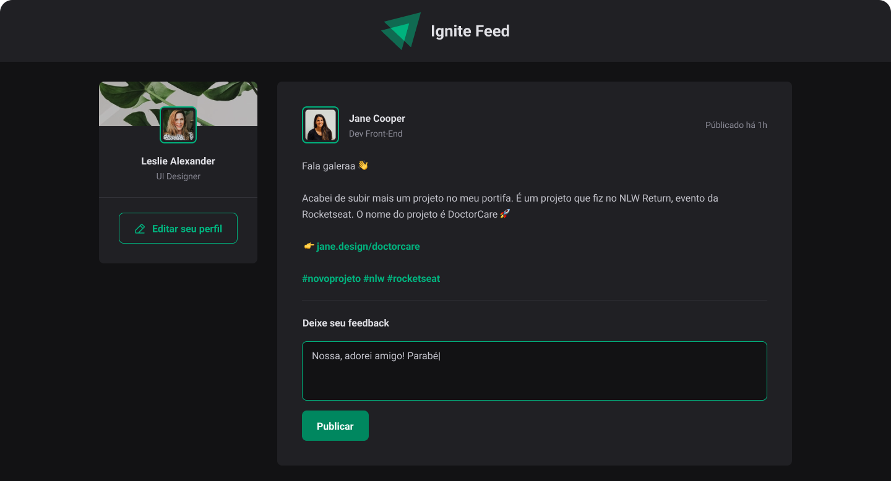

# Web Feed

This project is designed as a practice ground for using CSS Modules in React.
In this project, we will be building a forum-like application where users can post, comment, and interact with each other. The focus, however, will be on how we can effectively use CSS Modules to style our React components.


## Screenshots



## Installation

Follow these steps to set up the project:

1. **Clone the Repository:**
   ```bash
   git clone git@github.com:flaviomdutra/web-feed.git
   ```

2. **Install Dependencies:** We are using PNPM for package management. If you haven't installed it yet, you can do so with `npm install -g pnpm`. After that, you can install the dependencies with:
   ```bash
   pnpm install
   ```
   
## Run Locally

Start the server

```bash
  pnpm run dev
```


